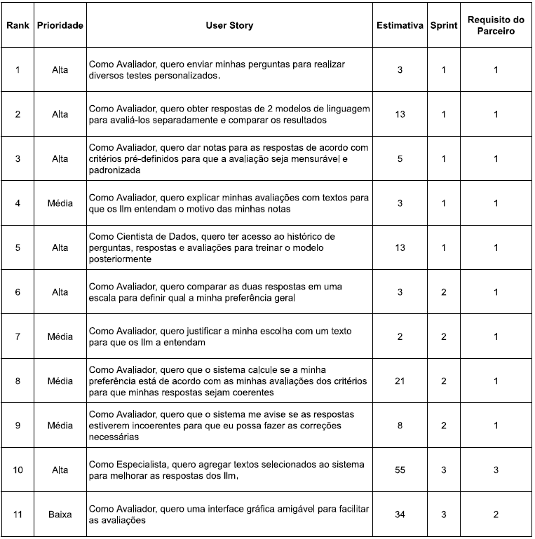

#  Sistema de base para Aprendizado por Reforço a partir de feedback humano para LLM

---

## 📚 Contexto do Negócio
Com a crescente adoção de **Modelos de Linguagem de Grande Escala (LLMs)**, torna-se essencial a prática de **retreinamento supervisionado** desses modelos a partir de **feedback humano estruturado**.
Inspirado em práticas de empresas como Google e OpenAI, este sistema busca viabilizar avaliações humanas de respostas de LLMs para futuros ajustes e melhorias de performance.

---

## 🧑‍🤝🧑 Stakeholders / Usuários
- **Usuários Avaliadores**: Avaliam a qualidade das respostas geradas pelos modelos.
- **Cientistas de Dados**: Utilizam os dados coletados para retreinamento e ajuste de LLMs.
- **Especialistas**: Fornecem dados especializados para melhoria das respostas e avaliam sua relevância de acordo com sua especialidade.

---

## 💥 Dores
- Dificuldade em obter feedback humano padronizado para comparação de respostas de LLMs.
- Necessidade de interface intuitiva para usuários não técnicos.
- Necessidade de armazenamento estruturado e seguro dos dados de avaliação.

---

## 📋 Requisitos

### ✅ Requisitos Funcionais
- Integração com 2 (duas) API´s públicas de LLM´s;
- Tela de interface para obtenção dos prompts e submissão às LLM´s;
- Telas de interface para obtenção de feedback humano, com avaliação de prompts;
- Gráficos de desempenho das LLM´s.

---

## 🗂️ Backlog do Produto

---

## 🗓️ Cronograma de Entregas

### 🏁 Sprint 1
- **Objetivo**: Aplicativo console com envio de prompts e coleta de avaliações individuais.
- **Entregas**:
  - Integração com APIs de LLMs.
  - Banco de dados estruturado para armazenamento.
- 📽️ [Link para vídeo Sprint 1](https://youtu.be/avEcBQLALLY)  
- 📄 [Link para documentação Sprint 1](doc/Sprint1)

### 🏁 Sprint 2
- **Objetivo**: Preferência entre respostas e verificação automática de coerência nas avaliações.
- **Entregas**:
  - Comparações e justificativas.
  - Correção automática de avaliações incoerentes.
- 📽️ [Link para vídeo Sprint 2](https://youtu.be/7d1iJLOYE2Q)  
- 📄 [Link para documentação Sprint 2](doc/Sprint2/)

### 🏁 Sprint 3
- **Objetivo**: Frontend, RAG e implementação.
- **Entregas**:
  - Embeddings
  - RAG - Retrieval Augmented Generation
  - Frontend
  - Implementação com servidor Flask
- 📽️ [Link para vídeo Sprint 3](https://youtu.be/M6efwwBkWlA)  
- 📄 [Link para documentação Sprint 2](doc/Sprint3/)
---

## 🛠️ Tecnologias Utilizadas
- **Python 3.11** (Linguagem de programação)
- **Tembo.io** (Servidor remoto de Banco de Dados)
- **PostgreSQL 15** (Banco de Dados)
- **Groq API** (Acesso a modelos LLM)
- **Llama / Gemma** (modelos LLM pré-treinados)
- **Vue** Frontend
- **CromaDB** Banco de Dados Vetorial
- **Flask** Servidor Backend

---

## 👨‍💻 Equipe
- **Francisco Douglas Quirino** - Desenvolvedor

---

> **Nota**: Este projeto foi desenvolvido como parte do Programa de Aprendizagem por Projetos Integrados (API) da Fatec São José dos Campos em parceria com a empresa Dom Rock.

